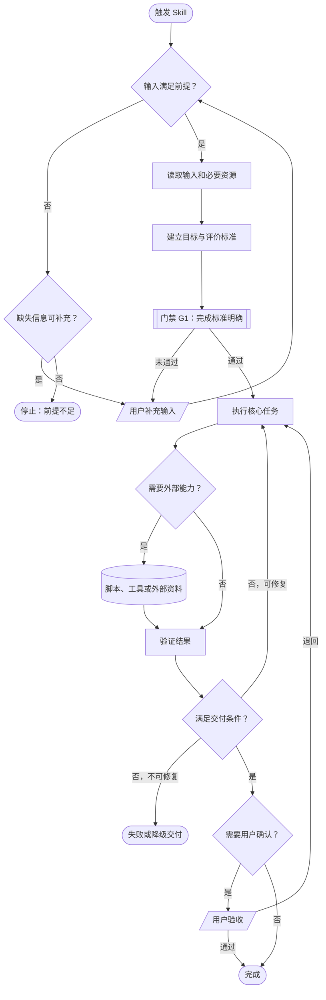
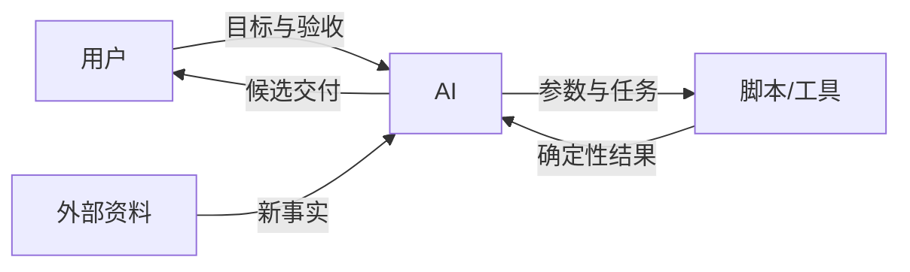

# Skill 拆解与测评报告规范

## 1. 报告原则

- 报告是学习型解剖，不是只有分数的检查清单。
- 开头先让读者看懂运行机制和整体质量，再展开证据与推理。
- 图负责呈现结构、控制流和关系；表负责呈现准确映射；文字负责解释因果和原则。
- 不把所有内容都画图。每种关系使用最小、最适合的表达形式。
- 报告展示顺序不等于分析顺序：内部最后评分，成品中评分前置。

## 2. 必需报告结构

完整报告使用以下顺序；证据不足时保留章节并明确写出限制，不用虚构内容填满模板。

```text
# Skill 拆解与测评报告：<名称>
> 一句话结论

## 0. Skill 运行全景图
## 1. 综合测评仪表盘
## 2. 测评结论摘要
## 3. 分析范围与 Skill 地图
## 4. 交付模型
## 5. 动作链与因果顺序
## 6. 责任分工
## 7. 门禁、约束与风险
## 8. 评分证据与扣分明细
## 9. 可迁移设计原则
## 10. 未知、冲突与未定义行为
## 11. 学习结论与迁移出口
```

局部拆解可以压缩无关章节，但不能省略范围、证据标签和未知项。

## 3. 标题与一句话结论

标题下立即写：

> 这个 Skill 把【输入】转化为【结果】，为【对象】解决【问题】；当【完成条件】成立并由【责任者】确认时完成。

完成条件未知时直说“现有材料未定义可观察完成条件”。

## 4. Skill 运行全景图

### 4.1 图的职责

主 Mermaid 图必须描述被分析 Skill 的运行机制，包括：

- 入口和输入前提；
- 核心动作；
- 条件分支与跳过路径；
- 真正的质量或安全门禁；
- 脚本、工具、外部资料和人工介入；
- 回退、修复、重试和循环；
- 完成、失败、暂停、部分完成或降级终态。

不要把文件目录图、六步分析过程或评分流程冒充运行全景图。

### 4.2 统一视觉语法

| Mermaid 写法 | 含义 |
|---|---|
| `A(["开始/完成/失败"])` | 流程状态 |
| `B["执行动作"]` | AI、系统或一般动作 |
| `C{"判断条件？"}` | 条件分支 |
| `G1[["门禁 G1：通过标准"]]` | 未通过不能继续的门禁 |
| `R[("脚本/工具/外部资料")]` | 外部能力或数据 |
| `U[/"用户输入或确认"/]` | 人工介入 |
| `A -. "推断" .-> B` | 原文未解释但证据支持的重要推断 |

不要依赖颜色表达含义，也不要添加装饰性样式。节点文字直接标明角色，例如 `AI｜比较方案`、`脚本｜验证格式`。

### 4.3 基础模板

下面是语法模板，必须用实际证据替换，不能把模板中的路径当成目标 Skill 的事实：



### 4.4 复杂度控制

- 线性或少分支流程使用 `LR`，多分支和循环使用 `TD`。
- 主图一般保留 8～18 个关键节点。
- 两种模式共享大部分流程时用一个条件分支；机制明显不同才增加局部图。
- 文件名、行号和长段证据放在图后表格中，不塞进节点。
- 原 Skill 未定义的失败路径画到“未定义行为”，不要猜测补齐。
- 图生成后逐边验证 Mermaid 语法和证据一致性。

主图后用不超过五条解释读图时最重要的门禁、循环和非成功终态，不复述所有节点。

## 5. 综合测评仪表盘

先给四个结果：

```text
设计质量：<分数>/100（<等级>）
质量门禁：<通过/有条件通过/未通过/未验证>
证据置信度：<百分比>（<高/中/低/很低>）
分析类型：<局部静态/完整静态/深度验证>
```

再展示八维得分：

| 维度 | 权重 | 得分 | 可视化 |
|---|---:|---:|---|
| 任务价值与范围边界 | 10 |  | `████████░░` |
| 发现与触发设计 | 15 |  |  |
| 交付契约 | 10 |  |  |
| 工作流与控制逻辑 | 20 |  |  |
| 分工与资源架构 | 15 |  |  |
| 鲁棒性与安全性 | 12 |  |  |
| 渐进式披露 | 8 |  |  |
| 验证、兼容与维护 | 10 |  |  |

得分条固定十格，按该维度得分率四舍五入填充，不能按绝对分数填充。默认不用雷达图：权重不同且面积容易误导。比较多个 Skill 时，才考虑使用共享尺度的分组条形图。

然后给门禁表：

| 门禁 | 状态 | 核心证据 | 影响 |
|---|---|---|---|

## 6. 测评结论摘要

用三组短列表表达：

- **最值得学习**：不超过三项，说明设计选择及其价值。
- **主要短板或风险**：不超过三项，优先列影响交付和门禁的问题。
- **最优先改进**：不超过三项，只提出会改变关键结果的修正。

这里展示结论，不展开完整证据；证据在后文对应章节。

## 7. 分析范围与 Skill 地图

先说明：目标路径或来源、目标环境、已读资源、未读资源、是否执行、分析限制。

然后使用：

| 资源 | 类型 | 用途 | 加载/调用时机 | 状态 | 证据 |
|---|---|---|---|---|---|

目录层级本身重要时可以增加简短文本树；引用关系复杂时再使用 Mermaid 依赖图。不要为简单的三四个文件增加第二张图。

## 8. 交付模型

包含：

1. 一句话交付定义；
2. 必需输入、可选输入和前提；
3. 主要输出与消费方式；
4. 完成、失败、暂停和降级条件；
5. 最终验收责任。

使用交付契约表：

| 项目 | 内容 | 必需/可选 | 状态 | 证据 |
|---|---|---|---|---|

## 9. 动作链与因果顺序

先给一行可观察动作链，再给动作明细：

| 编号 | 动作 | 输入 | 产物/状态变化 | 条件或失败路径 | 证据 |
|---|---|---|---|---|---|

关键顺序使用因果表：

| 先做 | 后做 | 依赖类型 | 排序理由 | 交换/删除的影响 | 证据性质 |
|---|---|---|---|---|---|

只解释会改变质量、安全或资源使用的顺序，不为每个普通相邻步骤制造因果故事。

## 10. 责任分工

默认使用责任矩阵：

| 动作 | 执行者 | 依据 | 产物 | 失败处理者 | 最终负责者 | 证据 |
|---|---|---|---|---|---|---|

当至少有三类执行者且存在多次交接时，增加责任关系图：



使用实际角色和交接内容替换模板。若矩阵已经清楚，不重复画图。

## 11. 门禁、约束与风险

先列图中门禁：

| ID | 门禁 | 触发阶段 | 通过标准 | 未通过行为 | 责任者 | 证据 |
|---|---|---|---|---|---|---|

再列风险—规则映射：

| 风险 | 触发条件 | 规则/约束 | 防护机制 | 失败表现 | 未覆盖缺口 | 证据 |
|---|---|---|---|---|---|---|

明确区分“被分析 Skill 的运行门禁”和“本报告对它设置的质量门禁 G0～G5”，不要混为一谈。

## 12. 评分证据与扣分明细

先写评分方法和 `N/A` 项，再按八个维度列出子项：

| 子项 | 评级 0～4 | 换算得分 | 证据 | 判断与扣分理由 | 改进方向 |
|---|---:|---:|---|---|---|

每个维度末尾写一条小结，解释最主要的得分来源和损失原因。最后复核总分与前置仪表盘一致。

## 13. 可迁移设计原则

先给原则总表：

| 原则 | 条件 | 动作 | 理由/风险 | 前提 | 边界/反例 | 原设计证据 | 迁移场景 |
|---|---|---|---|---|---|---|---|

只有当抽象层级本身有助于理解时，才为最重要的一至三条原则增加抽象阶梯：


图后写出完整的“条件—动作—理由—前提—边界”句子。图不能替代原则文本。

## 14. 未知、冲突与未定义行为

| ID | 类型 | 问题 | 影响范围 | 当前能否推断 | 需要什么证据 |
|---|---|---|---|---|---|

类型使用：`未知`、`冲突`、`缺失`、`未验证`、`未定义行为`。这一节不是附带免责声明，而是报告的重要分析产物。

## 15. 学习结论与迁移出口

最后回答：

- 最值得借鉴的三项设计是什么，为什么？
- 哪些只是当前工具、平台或作者偏好，不能直接迁移？
- 哪些原则可以带入下一个问题？
- 迁移前必须重新确认哪些前提？
- 创建类似 Skill 前，应收集哪些真实请求、失败案例或测试样本？

除非用户明确要求，不在这里自动生成新 Skill、重写原文件或给出修改补丁。

## 16. 最终一致性检查

- 主图每个关键节点和边都能找到证据或被标为推断。
- 图中所有非成功终态在正文有说明。
- 运行门禁与测评门禁没有混淆。
- 八维分数相加等于总分，`N/A` 已按规则重算。
- 证据置信度与实际分析范围相符。
- 前置摘要、详细评分和最终结论没有矛盾。
- 没有用分数代替因果解释，也没有用漂亮图形掩盖未知。
